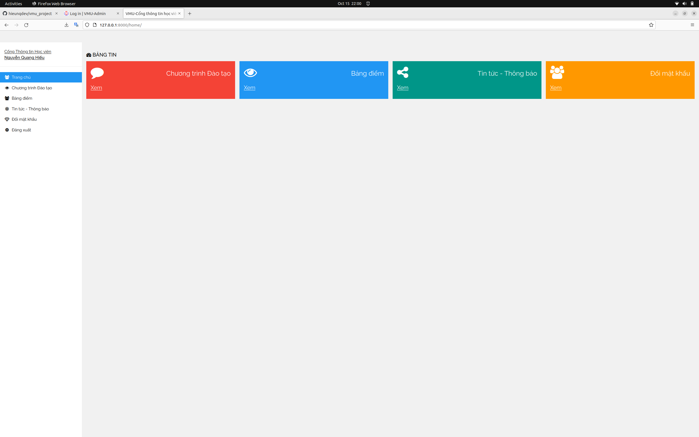
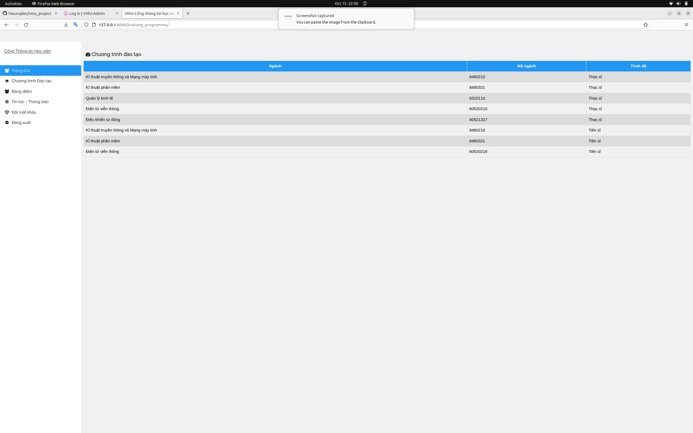
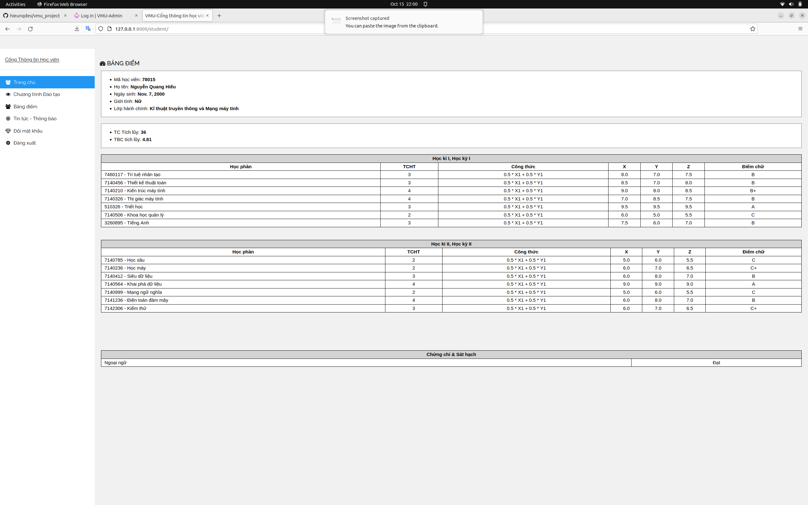
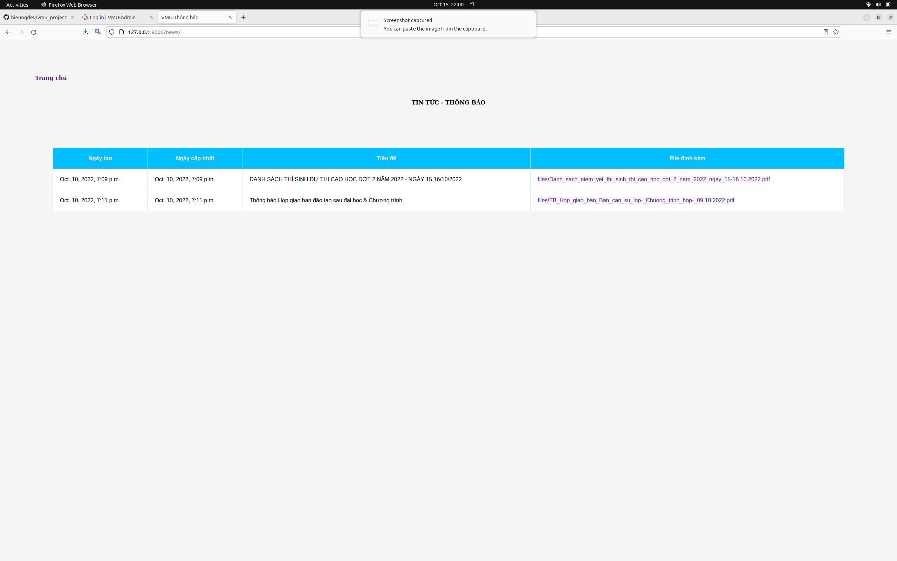
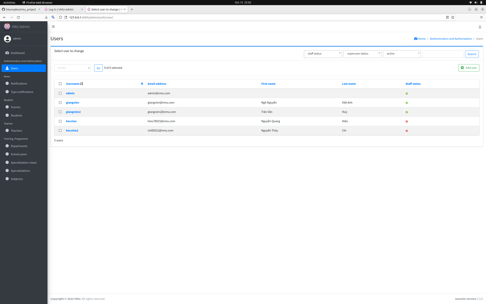
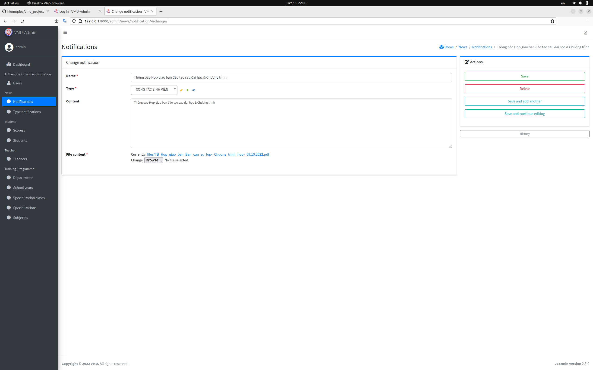
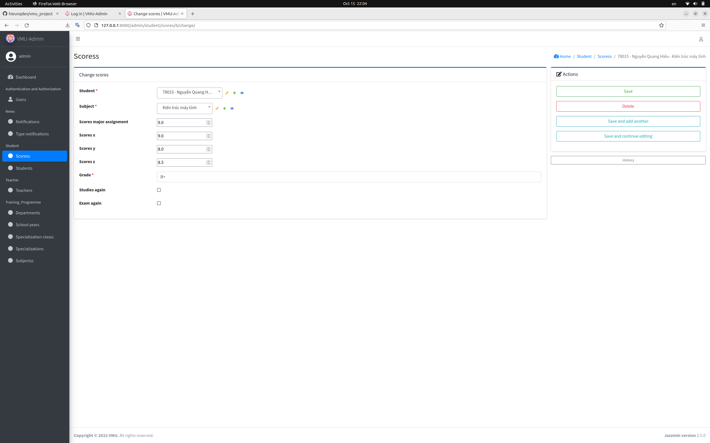
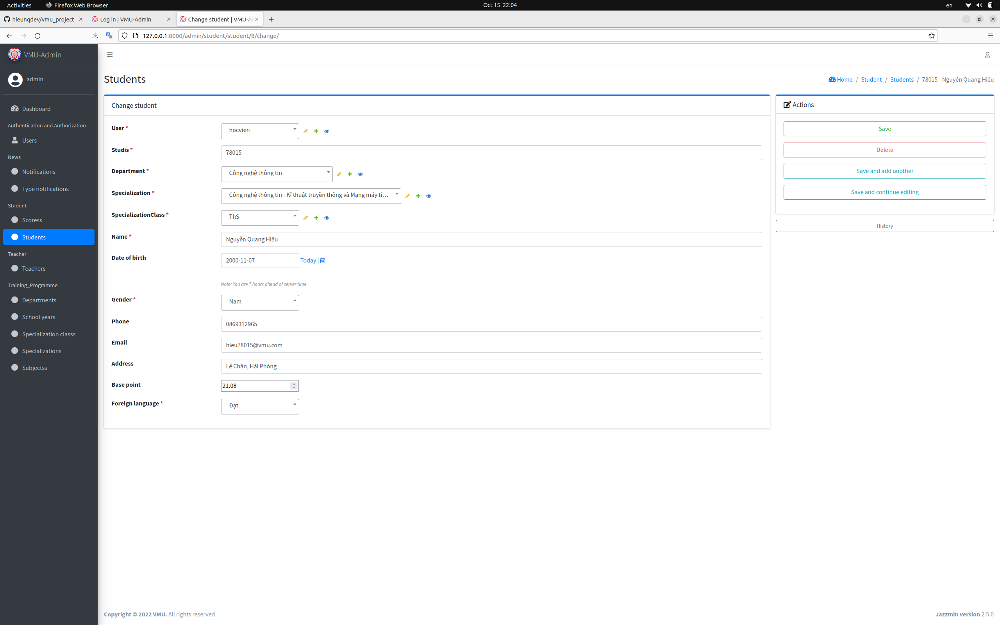
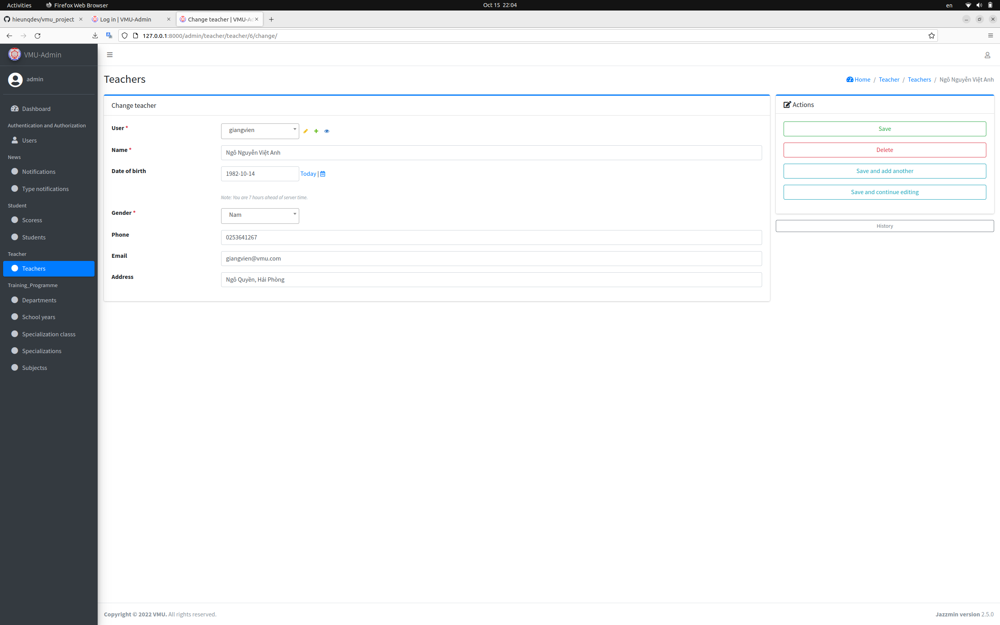
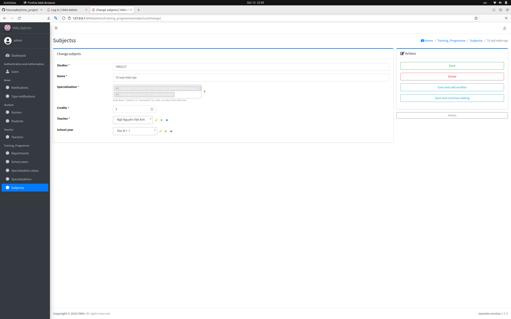

# VMU - Project
---
Information search application for postgraduate students of the Graduate Institute - Vietnam Maritime University.

## Diagram of Project
---


## Installation:
---
**1.Clone the Repo**
```
git clone https://github.com/hieunqdev/vmu_project.git
```

**2.Setup venv & Install Requirements**
```
python3 -m venv venv
source venv/bin/activate
cd vmu
pip install -r requirements.txt
```

**3.Migrate Database**
```
python manage.py makemigrations 
python manage.py migrate
```

**5.Start Server**
```
python manage.py runserver
```

## Screenshots
---
### StudentPage





### AdminPage/TeacherPage





